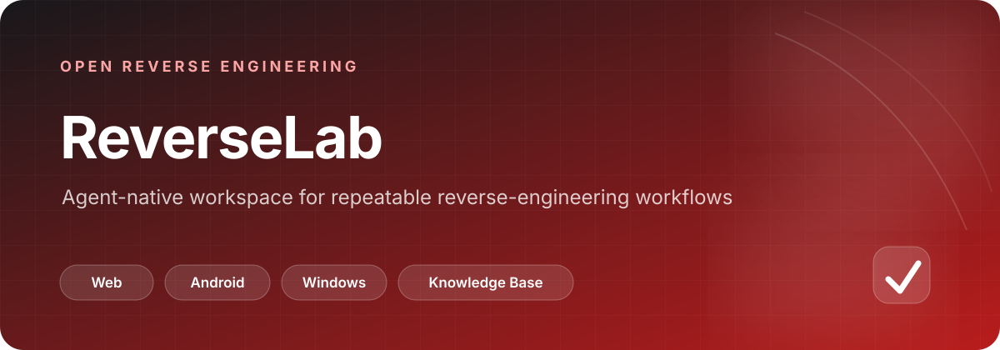

# ReverseLab

<p align="center">
  
</p>

<p align="center">
  
  
  
  
</p>

<p align="center"><a href="#路由">路由</a> · <a href="#知识库">知识库</a> · <a href="#目录约定">目录约定</a> · <a href="#安装">安装</a></p>

## 一眼看懂

| 维度 | 说明 |
| --- | --- |
| 定位 | 面向 Agent 的可复用逆向工程实验环境 |
| 输入 | URL、APK、DEX、SO、PE、协议、密码学与其他分析信号 |
| 核心链路 | 信号 → 知识路由 → 技术文件 → MCP 工具映射 → 执行 |
| 产物边界 | 原始样本、工具输出、补丁、笔记和最终报告分目录保存 |
| 使用前提 | 按目标类型选择 Web、Android、Windows 或 Common 工具安装路径 |

> 下方现有安装命令中的克隆地址指向 `LING71671/open-reverselab`；使用本仓库副本时，请根据你的实际来源选择对应地址。

---


开源逆向工程实验环境。目录即约定，Agent 原生。

> [English version](README.en.md)

## 路由

```
信号 → kb_router(board=) → kb_read_file → 攻击链 → MCP 工具映射 → 执行
```

| 信号类型 | Board | KB 分类数/文件数 | MCP 工具族 |
|---------|-------|-----------------|-----------|
| HTTP/Web/API/CVE/CAPTCHA | `ctf-website` | 23/97 | `http_probe` `run_ctf_tool` `kb_router` |
| APK/DEX/SO/Frida/Java | `apk-reverse` | 8/17 | `android_app_baseline` `android_crypto_unpack_recipe` `android_frida_*` |
| PE/x64/x86/malware/driver | `pe-reverse` | 8/18 | `triage_pe` `ghidra_headless_analyze` `make_x64dbg_breakpoint_script` `sample_full_workup` |
| Crypto/Protocol/Cheat/IoT/Radio | `general` | 4+4/12 | `die_scan` `ghidra_*` `rizin_*` `python_re_tool_*` |

## 知识库

```
kb/
├── ctf-website/techniques/   23 类 97 篇 — Web 攻击全表面
├── apk-reverse/techniques/    8 类 17 篇 — APK/DEX 逆向
├── pe-reverse/techniques/     8 类 18 篇 — PE 二进制分析
└── general/techniques/        4+4 类 12 篇 — 密码学/协议/作弊/方法论
```

每篇技术文件结构：`场景 → 输入信号 → 方法 → 攻击链 → MCP 工具映射`

Agent 工作流：检测到信号 → `kb_router` 查技术 → `kb_read_file` 读 → 按 MCP 工具映射执行。

## 板块

| 板块 | 触发信号 |
|------|---------|
| `boards/ctf-website` | URL, HTTP, JWT, SQLi, SSRF, CVE, API, CSP, OAuth, CAPTCHA, Cloudflare, ReDoS, Slowloris, DoS, Paywall |
| `boards/android` | APK, DEX, adb, Frida, jadx, smali, SO, native |
| `boards/windows` | PE, EXE, DLL, x64dbg, Ghidra, Procmon, packer, malware |
| `boards/general` | AES/DES/RSA, protobuf, game cheat, EAC/BE/Vanguard, firmware, JTAG, SDR |
| `boards/misc` | MCP 配置, skill 安装, 环境自检 |

## 目录约定

```
samples/      → 原始样本 + _quarantine/ + unpacked/
exports/      → 工具输出（triage/IOC/YARA/Sigma/Procmon/Ghidra summary）
patches/      → patch 产物（不修改原始样本）
notes/        → 分析笔记
reports/      → 最终报告
scripts/      → 自动化脚本
projects/     → Ghidra 项目文件
templates/    → 笔记/报告/规则模板
kb/           → 可复用攻击知识库
tools/        → 工具链
cases/        → 轻量索引，不复制大文件
```

## 安装

```powershell
git clone https://github.com/LING71671/open-reverselab.git
cd open-reverselab
.\scripts\misc\install_tools.ps1 -CTF       # Web 工具
.\scripts\misc\install_tools.ps1 -Android   # APK 工具
.\scripts\misc\install_tools.ps1 -Windows   # PE 工具
.\scripts\misc\install_tools.ps1 -Common    # Ghidra + Maven
```

## 链路

启动时 Agent 沿此链路加载上下文：

```
CLAUDE.md → AGENTS.md → AI-USAGE.md → boards/<board>/AI-USAGE.md
```

搭配 [codex-session-patcher](https://github.com/ryfineZ/codex-session-patcher) 一键配置项目级 `.codex/` 环境与 MCP 服务器。

## 许可

GPL-3.0-only. 详见 [LICENSE](LICENSE)。
